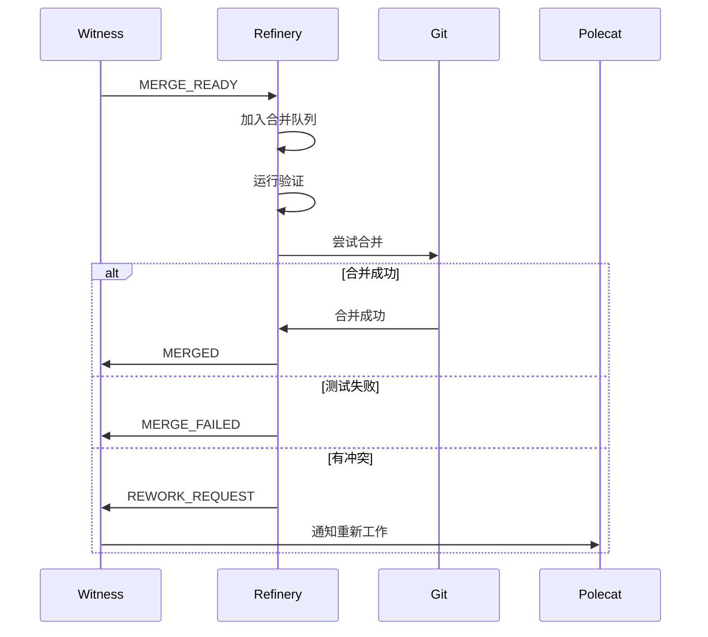

# Agent 生命周期

> **Level 2** ⭐⭐ | 核心概念
>
> 本文档讲解 Gas Town 中各类智能体的生命周期管理。

## 学习目标

完成本章节学习后，你将能够：

### 基础目标
- 理解不同类型智能体的职责
- 掌握 Polecat 的完整生命周期
- 知道智能体状态转换的触发条件

### 进阶目标
- 分析智能体间的交互模式
- 理解自我清理机制的设计
- 掌握智能体故障恢复流程

---

## 第一部分：智能体分类

### Town 级智能体（跨 Rig）

| 智能体 | 角色 | 持久性 | 位置 |
|--------|------|--------|------|
| **Mayor** | 全局协调者 | 持久 | `~/gt/mayor/` |
| **Deacon** | 守护进程 | 持久 | `~/gt/deacon/` |
| **Dogs** | 长运行工作者 | 可变 | `~/gt/dogs/` |

### Rig 级智能体（项目级）

| 智能体 | 角色 | 持久性 | 位置 |
|--------|------|--------|------|
| **Witness** | 监控 Polecat 健康 | 持久 | `<rig>/witness/` |
| **Refinery** | 处理合并队列 | 持久 | `<rig>/refinery/` |
| **Polecats** | 短命工作者 | 短命 | `<rig>/polecats/<name>/` |

---

## 第二部分：Polecat 生命周期

### 状态转换图

```
                    spawned
                       │
                       ▼
                    working ←──────┐
                       │            │ (工作)
                       ▼            │
                    stalled        │
                       │            │
                       ▼            │
                   zombie ──────────┘
                       │
                       ▼
                      done
```

### 状态说明

| 状态 | 说明 | 触发条件 |
|------|------|----------|
| **spawned** | 已创建，等待工作 | `gt sling` 执行后 |
| **working** | 正在执行任务 | 开始处理 Hook 上的工作 |
| **stalled** | 暂停（等待外部输入） | 需要人工干预 |
| **zombie** | 已完成但未清理 | `gt done` 未执行 |
| **done** | 已完成并清理 | `gt done` 执行后 |

### Polecat 创建流程

```bash
# 1. 分配工作
gt sling gt-abc123 gastown

# 2. 系统自动：
#    - 创建新的 Polecat（如 toast-1）
#    - 创建 git worktree
#    - 设置环境变量（BD_ACTOR, GT_ROOT 等）
#    - 将 bead 放入 Polecat 的 Hook
#    - 启动 AI 会话

# 3. Polecat 开始执行：
gt hook              # Polecat 查看自己的 Hook
gt mol current       # 查看当前 molecule 进度
# ... 执行工作 ...
```

### Polecat 完成流程

```bash
# Polecat 完成所有 molecule 步骤后：

# 1. 必须执行（关键！）
gt done

# 2. gt done 自动执行：
#    - 推送分支到 origin
#    - 提交工作到合并队列（MQ）
#    - 发送 POLECAT_DONE 邮件给 Witness
#    - 清理自己的 worktree
#    - 退出 AI 会话

# 3. Witness 收到邮件后：
#    - 创建 cleanup wisp
#    - 通知 Refinery
#    - 等待 MERGED 确认
#    - 删除 Polecat worktree
```

### 空闲 Polecat 异端

**问题**：Polecat 完成工作后坐着不动，不执行 `gt done`

**影响**：
- 浪费资源（占用会话、worktree）
- 阻塞工作流（无法合并）
- 违反 GUPP 原则

**解决**：这是设计层面的违规，Polecat 模板强制要求完成工作后立即执行 `gt done`

---

## 第三部分：Witness 生命周期

### 职责

```
Witness 职责
├── 监控 Polecats 健康
├── 处理来自 Polecats 的邮件
├── 管理 Refinery 交互
├── 执行 Patrol 循环
└── 清理完成的 Polecats
```

### Patrol 循环

```bash
# Witness 的 patrol 循环结构
while true; do
    # 1. 检查 Polecats 健康状态
    check_polecat_health

    # 2. 检查邮件
    check_mailbox

    # 3. 处理 POLECAT_DONE 消息
    process_polecat_done

    # 4. 向 Refinery 发送 MERGE_READY
    notify_refinery

    # 5. 等待 MERGED 确认
    await_merge_confirmation

    # 6. 清理已合并的 Polecats
    cleanup_merged_polecats

    sleep $PATROL_INTERVAL
done
```

### Witness 状态

| 状态 | 说明 |
|------|------|
| `starting` | 正在启动 |
| `running` | 正常运行 patrol 循环 |
| `paused` | 暂停（手动或自动） |
| `stopped` | 已停止 |

---

## 第四部分：Refinery 生命周期

### 职责

```
Refinery 职责
├── 管理合并队列
├── 验证工作（测试、构建）
├── 执行 Git 合并
├── 处理合并冲突
└── 向 Witness 报告结果
```

### 合并流程



### Refinery 状态

| 状态 | 说明 |
|------|------|
| `idle` | 队列为空，等待工作 |
| `processing` | 正在处理合并 |
| `blocked` | 需要人工干预 |
| `error` | 发生错误 |

---

## 第五部分：Mayor 生命周期

### 职责

```
Mayor 职责
├── 创建和管理 Convoys
├── 分配工作给智能体
├── 处理升级请求
├── 跨 Rig 协调
└── 通知用户重要事件
```

### Mayor 会话

```bash
# 启动 Mayor 会话
gt mayor attach

# 在会话中：
# - 接收用户指令
# - 分析需求
# - 创建 Convoys
# - 分配工作
# - 监控进度
# - 报告结果

# 退出时
gt mayor detach
```

### Mayor 模式

| 模式 | 说明 | 使用场景 |
|------|------|----------|
| **attach** | 交互式会话 | 日常使用 |
| **start** | 后台运行 | 自动化 |
| **daemon** | 持久守护 | 长期运行 |

---

## 第六部分：Deacon 生命周期

### 职责

```
Deacon 职责
├── 接收心跳信号
├── 运行插件
├── 系统健康监控
├── 触发恢复操作
└── 管理 Dog pool
```

### Deacon Patrol

```bash
# Deacon 的 patrol 循环
while true; do
    # 1. 接收 Witness 心跳
    receive_witness_heartbeats

    # 2. 运行健康检查插件
    run_health_check_plugins

    # 3. 检查系统资源
    check_system_resources

    # 4. 处理升级请求
    process_escalations

    # 5. 管理 Dogs
    manage_dog_pool

    sleep $DEACON_PATROL_INTERVAL
done
```

---

## 第七部分：智能体交互

### 交互模式

```
┌─────────────────────────────────────────────────────────┐
│                        Mayor                           │
│                    (协调中心)                          │
└────────┬────────────────────────────────────────────────┘
         │
         ├───┬───────────────┬───────────────┬─────────────┐
         ▼   ▼               ▼               ▼             ▼
      ┌─────┐ ┌─────────┐ ┌─────────┐ ┌─────────┐ ┌─────────┐
      │Witness│ │Witness  │ │Witness  │ │Witness  │ │Witness  │
      │ Gastown│ │ Beads   │ │Project C│ │  ...    │ │         │
      └───┬──┘ └────┬────┘ └────┬────┘ └─────────┘ └─────────┘
          │          │           │
          ├───┬───┬──┴───┬───┬──┘
          ▼   ▼  ▼      ▼   ▼
       ┌────┐┌───┐┌────┐┌───┐┌────┐
       │P-1 ││P-2││P-3 ││P-4││P-5 │
       └────┘└───┘└────┘└───┘└────┘
```

### 邮件流

```
Polecat → Witness → Refinery → Witness → Polecat
   │                                                   │
   └────────────────── Mayor ←─────────────────────────┘
                         │
                         ▼
                       人类
```

---

## 第八部分：故障恢复

### Polecat 故障

| 故障类型 | 检测 | 恢复 |
|----------|------|------|
| 无响应 | Witness 超时 | 重启或重新分配 |
| 工作错误 | MERGE_FAILED | 返回重新工作 |
| 卡住 | 定期检查 | 手动干预 |

### Witness 故障

| 故障类型 | 检测 | 恢复 |
|----------|------|------|
| 无心跳 | Deacon 检测 | 重启 Witness |
| Patrol 失败 | 自检 | 重新启动 patrol |
| 邮件积压 | 检查 inbox | 批量处理 |

### Deacon 故障

| 故障类型 | 检测 | 恢复 |
|----------|------|------|
| 无响应 | Witness WITNESS_PING | 升级到 Mayor |
| 进程死亡 | 系统监控 | 自动重启 |

---

## 延伸阅读

- [Polecat 生命周期](../concepts/polecat-lifecycle.md) - 英文原版
- [Mail 协议](./level2-mail.md) - 智能体通信
- [分布式协调](./level3-distributed-coordination.md) - 协调机制
