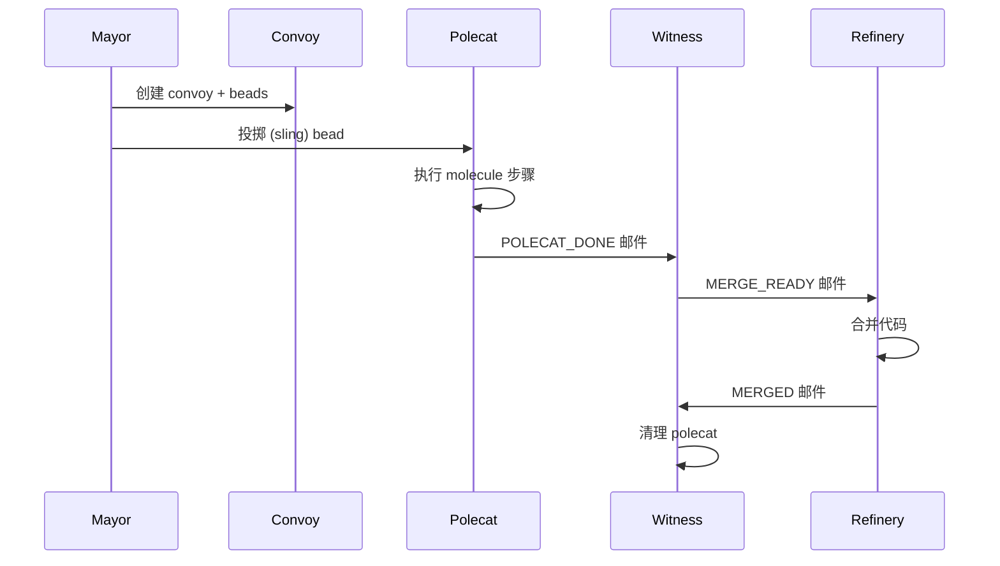
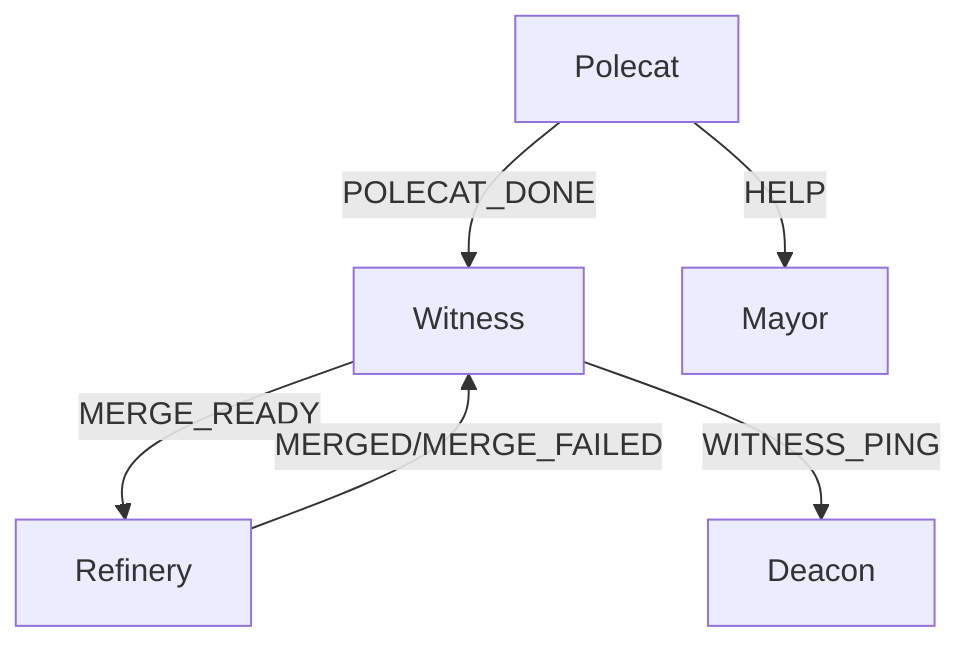

# 架构概览

> **Level 2** ⭐⭐ | 核心概念
>
> 本文档深入讲解 Gas Town 的两级架构和核心组件。

## 学习目标

完成本章节学习后，你将能够：

### 基础目标
- 理解 Gas Town 的两级架构设计
- 掌握核心组件的职责
- 知道数据在系统中的流转路径

### 进阶目标
- 分析组件间的通信机制
- 理解 Hook 系统的工作原理
- 掌握智能体生命周期管理

---

## 第一部分：两级架构

### 设计理念

Gas Town 将**协调**与**执行**分离：

```
┌─────────────────────────────────────────────────────┐
│                    Town (~/gt/)                      │
│              协调层：跨项目管理                        │
│  ┌─────────┐  ┌─────────┐  ┌─────────────────────┐  │
│  │ Mayor   │  │ Deacon  │  │ Dogs                │  │
│  │ 协调者   │  │ 守护进程 │  │ 维护智能体           │  │
│  └─────────┘  └─────────┘  └─────────────────────┘  │
└─────────────────────────────────────────────────────┘
                          │
        ┌─────────────────┼─────────────────┐
        ▼                 ▼                 ▼
┌─────────────┐  ┌─────────────┐  ┌─────────────┐
│   Rig A     │  │   Rig B     │  │   Rig C     │
│ 执行层：项目  │  │ 执行层：项目  │  │ 执行层：项目  │
│ ┌─────────┐ │  │ ┌─────────┐ │  │ ┌─────────┐ │
│ │Witness  │ │  │ │Witness  │ │  │ │Witness  │ │
│ │Refinery │ │  │ │Refinery │ │  │ │Refinery │ │
│ │Polecats │ │  │ │Polecats │ │  │ │Polecats │ │
│ └─────────┘ │  │ └─────────┘ │  │ └─────────┘ │
└─────────────┘  └─────────────┘  └─────────────┘
```

### Town 级组件

| 组件 | 职责 | 持久性 |
|------|------|--------|
| **Mayor** | 全局协调者，处理跨项目通信和升级 | 持久 |
| **Deacon** | 守护进程，运行插件和监控 | 持久 |
| **Dogs** | 跨项目批处理的长运行工作者 | 可变 |

### Rig 级组件

| 组件 | 职责 | 持久性 |
|------|------|--------|
| **Witness** | 监控 Polecat 健康，处理轻推和清理 | 持久 |
| **Refinery** | 处理合并队列，运行验证 | 持久 |
| **Polecats** | 分配给特定 issues 的短命工作者 | 短命 |

---

## 第二部分：目录结构

```
~/gt/                           # Town 根目录
├── .beads/                     # Town 级 beads (hq-* 前缀)
│   ├── config.yaml             # Beads 配置
│   ├── issues.jsonl            # Town issues (邮件、智能体、convoy)
│   └── routes.jsonl            # 前缀 → rig 路由表
├── mayor/                      # Mayor 配置
│   └── town.json               # Town 配置
└── <rig>/                      # 项目容器（非 git clone）
    ├── config.json             # Rig 身份和 beads 前缀
    ├── mayor/rig/              # 规范克隆（beads 位于此）
    │   └── .beads/             # Rig 级 beads 数据库
    ├── refinery/rig/           # mayor/rig 的 worktree
    ├── witness/                # 无克隆（仅监控）
    ├── crew/<name>/            # 人类工作区（完整克隆）
    └── polecats/<name>/        # 工作者 worktrees（从 mayor/rig）
```

### Worktree 架构

Polecats 和 Refinery 是 git worktree，而非完整克隆：

```bash
# 从 polecat/manager.go - worktrees 基于 mayor/rig
git worktree add -b polecat/<name>-<timestamp> polecats/<name>
```

**优势**：
- 快速生成
- 共享对象存储
- 隔离工作区

---

## 第三部分：Beads 路由

### 路由表

`routes.jsonl` 文件将 issue ID 前缀映射到 rig 位置：

```jsonl
{"prefix":"hq-","path":"."}
{"prefix":"gt-","path":"gastown/mayor/rig"}
{"prefix":"bd-","path":"beads/mayor/rig"}
```

### 路由解析

路由指向 `mayor/rig` 因为那是规范的 `.beads/` 所在位置：

```bash
bd show hq-mayor    # 路由到 town beads (~/.gt/.beads)
bd show gt-xyz      # 路由到 gastown/mayor/rig/.beads
```

---

## 第四部分：数据流

### 工作分配流



### 通信流



---

## 第五部分：Hook 系统

### Hook 概念

Hook 是每个智能体的主要工作队列——一个特殊的 pinned bead。

### GUPP 原则

**Gas Town 通用推进原则**：

> "如果你的 Hook 上有工作，你必须执行它"

这确保智能体自主推进工作，无需等待外部指令。

### Hook 管理

```bash
# 查看我的 Hook 上有什么
gt hook

# 查看 molecule 进度
gt mol current

# 完成工作
gt done
```

---

## 第六部分：核心概念总结

| 概念 | 说明 | 相关命令 |
|------|------|----------|
| **Town** | 工作空间根目录 | `gt install <path>` |
| **Rig** | 项目容器 | `gt rig add/remove/list` |
| **Polecat** | 短命工作者 | `gt polecat spawn` |
| **Witness** | Rig 监控者 | `gt witness start` |
| **Refinery** | 合并队列管理 | `gt refinery status` |
| **Convoy** | 工作追踪单元 | `gt convoy create/list/show` |
| **Hook** | 智能体工作队列 | `gt hook` |
| **Bead** | 原子工作单元 | `bd create/show/list` |

---

## 延伸阅读

- [Beads 系统](./level2-beads.md) - 工作追踪核心
- [Agent 生命周期](./level2-agent-lifecycle.md) - 智能体管理
- [Mail 通信](./level2-mail.md) - 智能体间通信
