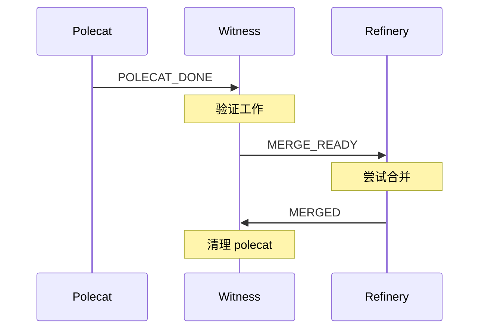
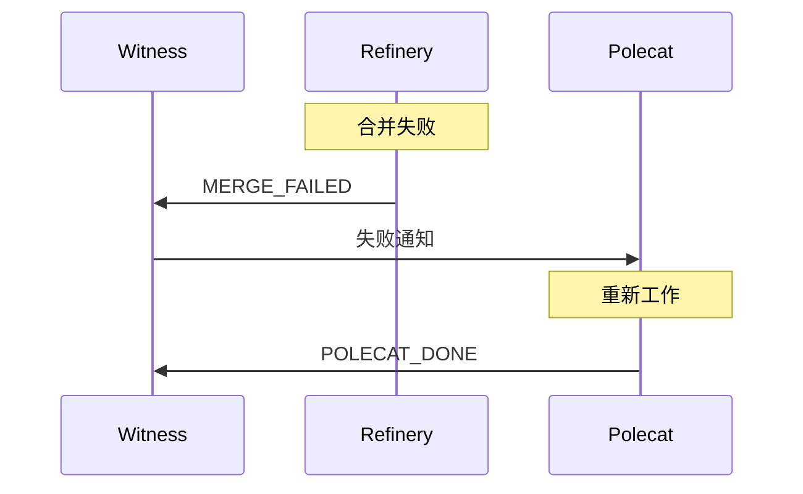
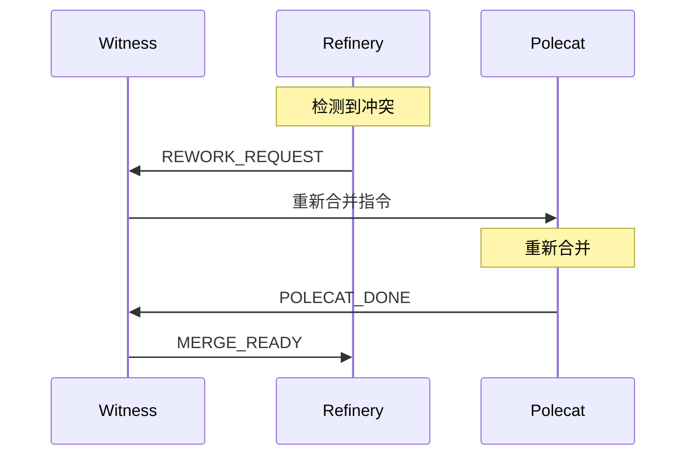

# Mail 通信系统

> **Level 2** ⭐⭐ | 核心概念
>
> 本文档讲解 Gas Town 智能体间的异步通信机制。

## 学习目标

完成本章节学习后，你将能够：

### 基础目标
- 理解 Mail 系统的设计和工作原理
- 掌握常用消息类型和格式
- 知道如何发送和接收邮件

### 进阶目标
- 理解异步通信的权衡
- 掌握消息协议规范
- 知道如何扩展消息类型

---

## 第一部分：为什么需要 Mail？

### 设计选择

| 方案 | 优势 | 劣势 | 选择 |
|------|------|------|------|
| **直接 RPC** | 实时、简单 | 紧耦合、同步阻塞 | ❌ |
| **消息队列** | 解耦、可靠 | 引入新组件 | ❌ |
| **Mail (Beads)** | 解耦、可审计、持久化 | 异步延迟 | ✅ |

### 核心优势

```
优势一：解耦
├── 智能体不需要知道彼此的位置
└── 通过邮件地址寻址

优势二：可审计
├── 所有通信都有记录
└── 可以回溯历史消息

优势三：可靠性
├── 消息持久化在 Beads 中
└── 智能体重启后不丢失

优势四：灵活性
├── 支持延迟处理
└── 支持批处理
```

---

## 第二部分：Mail 基础

### Mail 是什么？

Mail 是使用 `type=message` 的 Beads 实现的异步消息系统，由 `gt mail` 处理路由。

### 邮件地址格式

```
{rig}/{role}
{rig}/{type}/{name}
```

**示例**：

```
gastown/witness         # Gastown 的 Witness
beads/refinery          # Beads 的 Refinery
gastown/polecats/toast  # 特定的 Polecat
mayor                   # Town 级别的 Mayor
deacon                  # Town 级别的 Deacon
```

### 邮件结构

```json
{
  "id": "hq-msg123",
  "type": "message",
  "from": "gastown/polecats/toast",
  "to": "gastown/witness",
  "subject": "POLECAT_DONE toast",
  "body": "Exit: MERGED\nIssue: gt-abc12\n...",
  "created_at": "2025-01-15T10:30:00Z",
  "read": false
}
```

---

## 第三部分：消息类型

### 完整消息类型表

| 类型 | 路由 | 用途 |
|------|------|------|
| **POLECAT_DONE** | Polecat → Witness | 信号工作完成 |
| **MERGE_READY** | Witness → Refinery | 分支准备合并 |
| **MERGED** | Refinery → Witness | 合并成功 |
| **MERGE_FAILED** | Refinery → Witness | 合并失败 |
| **REWORK_REQUEST** | Refinery → Witness | 需要重新合并 |
| **WITNESS_PING** | Witness → Deacon | 二阶监控 |
| **HELP** | 任意 → Mayor | 请求干预 |
| **HANDOFF** | 智能体 → 自身/后继者 | 会话连续性 |

### POLECAT_DONE

**路由**：Polecat → Witness

**用途**：信号工作完成，触发清理流程

**主题格式**：`POLECAT_DONE <polecat-name>`

**正文格式**：
```
Exit: MERGED|ESCALATED|DEFERRED
Issue: <issue-id>
MR: <mr-id>
Branch: <branch>
```

**示例**：
```
POLECAT_DONE toast
Exit: MERGED
Issue: gt-abc123
MR: 42
Branch: polecat/toast-feature-xyz
```

### MERGE_READY

**路由**：Witness → Refinery

**用途**：信号分支准备好合并队列处理

**主题格式**：`MERGE_READY <polecat-name>`

**正文格式**：
```
Branch: <branch>
Issue: <issue-id>
Polecat: <polecat-name>
Verified: clean git state, issue closed
```

### MERGED

**路由**：Refinery → Witness

**用途**：确认分支成功合并，可以清理 polecat

**主题格式**：`MERGED <polecat-name>`

**正文格式**：
```
Branch: <branch>
Issue: <issue-id>
Polecat: <polecat-name>
Rig: <rig>
Target: <target-branch>
Merged-At: <timestamp>
Merge-Commit: <sha>
```

### HELP

**路由**：任意 → 升级目标（通常是 Mayor）

**用途**：请求对卡住/阻塞工作的干预

**主题格式**：`HELP: <brief-description>`

**正文格式**：
```
Agent: <agent-id>
Issue: <issue-id>
Problem: <description>
Tried: <what was attempted>
```

**示例**：
```
HELP: 无法解决测试失败
Agent: gastown/polecats/toast
Issue: gt-abc123
Problem: 测试持续失败，无法识别原因
Tried:
- 更新依赖
- 清理缓存
- 检查配置
```

### HANDOFF

**路由**：智能体 → 自身（或后继者）

**用途**：跨上下文限制/重启的会话连续性

**主题格式**：`🤝 HANDOFF: <brief-context>`

**正文格式**：
```
attached_molecule: <molecule-id>
attached_at: <timestamp>

## 上下文
<给后继者的笔记>

## 状态
<事情当前状态>

## 下一步
<后继者应该做什么>
```

---

## 第四部分：使用 Mail

### 发送邮件

```bash
# 基本发送
gt mail send <address> -s "主题" -m "内容"

# 示例
gt mail send gastown/witness -s "状态检查" -m "一切正常"

# 发送给多个收件人
gt mail send gastown/witness beads/refinery -s "通知" -m "消息"

# 从文件发送
gt mail send gastown/witness -s "报告" -f report.txt
```

### 接收邮件

```bash
# 查看收件箱
gt mail inbox

# 显示最新消息
gt mail inbox --tail 5

# 阅读特定消息
gt mail read <message-id>

# 标记为已读
gt mail ack <message-id>

# 清空收件箱
gt mail clear
```

### 邮件搜索

```bash
# 按发送者搜索
gt mail list --from="gastown/polecats/*"

# 按类型搜索
gt mail list --subject="POLECAT_DONE"

# 按日期搜索
gt mail list --since="2025-01-01"
gt mail list --until="2025-01-31"
```

---

## 第五部分：协议规范

### 主题行规范

```
[TYPE_PREFIX]: [描述]

TYPE_PREFIX: 大写，标识消息类型
描述: 人类可读的简短说明
```

**示例**：
```
POLECAT_DONE nux
MERGE_READY greenplace/nux
HELP: Polecat 卡在测试失败
🤝 HANDOFF: Schema 工作进行中
```

### 正文结构规范

```
Key-Value 结构化数据
(空行)
Markdown 自由内容
```

**好的示例**：
```
Exit: MERGED
Issue: gt-abc123
Branch: polecat/toast-feature

工作已完成，请审查。
测试通过，代码已推送。
```

### 地址规范

| 格式 | 说明 | 示例 |
|------|------|------|
| `{rig}/witness` | Rig 的 Witness | `gastown/witness` |
| `{rig}/refinery` | Rig 的 Refinery | `beads/refinery` |
| `{rig}/polecats/{name}` | 特定 Polecat | `gastown/polecats/toast` |
| `mayor` | Town 级别 Mayor | `mayor` |
| `deacon` | Town 级别 Deacon | `deacon` |

---

## 第六部分：协议流程

### Polecat 完成流程



### 合并失败流程



### 需要重新合并流程



---

## 第七部分：高级用法

### 批量处理

```bash
# 批量读取
gt mail read --all

# 批量确认
gt mail ack --all

# 批量发送
gt mail broadcast "系统维护通知"
```

### 邮件过滤

```bash
# 未读邮件
gt mail list --unread

# 紧急邮件
gt mail list --priority=high

# 特定类型
gt mail list --type="POLECAT_DONE"
```

### 邮件模板

```bash
# 使用模板发送
gt mail send gastown/witness --template=completion \
  --var=issue=gt-abc123 \
  --var=polecat=toast
```

---

## 第八部分：故障排查

### 邮件未送达

```bash
# 检查邮件队列
gt mail queue

# 检查路由
bd show routes

# 手动重试
gt mail retry <message-id>
```

### 邮件积压

```bash
# 查看积压情况
gt mail backlog

# 批量清理
gt mail clear --force

# 增加处理频率
gt config mail.process_interval 10
```

### 地址错误

```bash
# 验证地址
gt mail validate gastown/witness

# 列出有效地址
gt mail addresses
```

---

## 延伸阅读

- [Mail 协议](../design/mail-protocol.md) - 完整协议规范
- [Agent 生命周期](./level2-agent-lifecycle.md) - 智能体交互
- [分布式协调](./level3-distributed-coordination.md) - 协调机制
