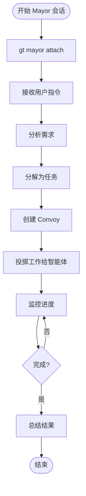
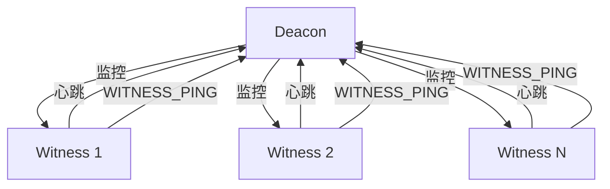
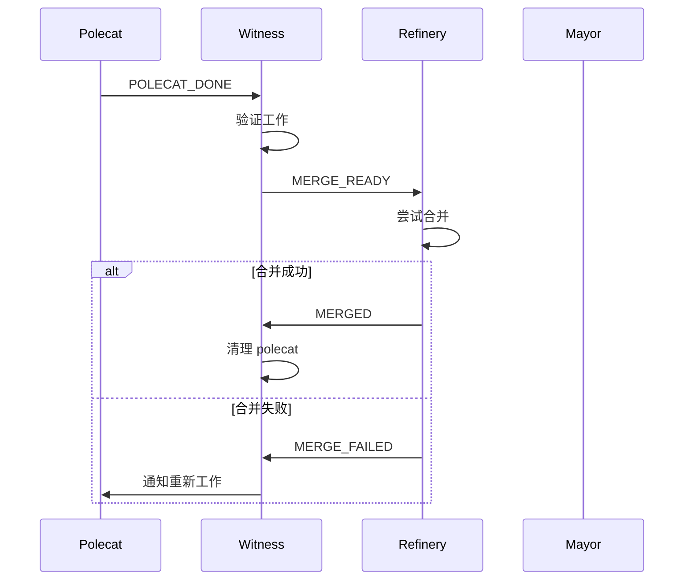

# 分布式协调机制

> **Level 3** ⭐⭐⭐ | 进阶分析
>
> 本文档深入讲解 Gas Town 的分布式协调机制，包括 Mayor 和 Deacon 如何实现大规模智能体协调。

## 学习目标

完成本章节学习后，你将能够：

### 基础目标
- 理解 Mayor 的协调职责和工作模式
- 掌握 Deacon 的监控和恢复机制
- 知道智能体间如何通过 Mail 异步通信

### 进阶目标
- 分析 Convoy 作为工作追踪单元的设计
- 理解升级链路和故障恢复流程
- 掌握分布式环境下的状态同步

### 专家目标
- 设计类似的多智能体协调系统
- 实现自定义协调策略
- 优化大规模智能体部署性能

---

## 第一部分：Mayor 协调机制

### Mayor 职责

Mayor 是你的主要 AI 协调者，负责：

| 职责 | 说明 | 相关命令 |
|------|------|----------|
| **Convoy 管理** | 创建和跟踪工作单元 | `gt convoy create/list/show` |
| **工作分配** | 将 beads 投掷给智能体 | `gt sling` |
| **跨 Rig 通信** | 协调多个项目的工作 | `gt mail` |
| **升级处理** | 处理来自智能体的 HELP 请求 | `gt escalation` |
| **通知** | 向人类报告重要事件 | `gt notify` |

### Mayor 工作流



### Convoy 协调

Convoy 是 Mayor 协调的核心单元：

```bash
# 创建 convoy
gt convoy create "用户认证系统" gt-abc123 gt-def456 gt-ghi789

# 添加更多 issues
gt convoy add <convoy-id> gt-jkl012 gt-mno345

# 分配给智能体
gt sling gt-abc123 gastown
gt sling gt-def456 gastown

# 监控进度
gt convoy list
gt convoy show <convoy-id>
```

### Convoy 状态模型

```
Convoy 状态转换：

created → active → completing → completed
                  ↓
               failed
                  ↓
               escalated
```

---

## 第二部分：Deacon 监控机制

### Deacon 职责

Deacon 是守护进程信标，负责：

| 职责 | 说明 | 机制 |
|------|------|------|
| **心跳监控** | 接收来自智能体的心跳 | 定期检查 |
| **插件执行** | 运行健康检查和监控脚本 | 插件系统 |
| **故障检测** | 识别卡住或失败的智能体 | 超时检测 |
| **恢复触发** | 启动自动恢复流程 | 升级系统 |
| **系统健康** | 监控 Dolt、Tmux 等基础设施 | 健康检查 |

### Deacon Patrol 循环

```bash
# Deacon 的 patrol 循环结构
while true; do
    # 1. 检查所有 witness 心跳
    check_witness_heartbeats

    # 2. 运行健康检查插件
    run_health_check_plugins

    # 3. 检查卡住的 polecats
    check_stalled_polecats

    # 4. 处理升级请求
    process_escalations

    # 5. 发送系统状态报告
    report_system_status

    sleep $PATROL_INTERVAL
done
```

### Deacon 到 Witness 的关系



### 二阶监控

**问题**：谁来监控监控者？

**解决方案**：Witness 定期发送 `WITNESS_PING` 给 Deacon

```
如果 Deacon 无响应：
    Witness 等待 N 个周期
    Witness 升级到 Mayor
    Mayor 通知人类
```

---

## 第三部分：Mail 通信系统

### 为什么用 Mail？

| 方案 | 优势 | 劣势 | 选择 |
|------|------|------|------|
| **直接 RPC** | 实时、简单 | 紧耦合、同步阻塞 | ❌ |
| **消息队列** | 解耦、可靠 | 引入新组件 | ❌ |
| **Mail (Beads)** | 解耦、可审计、持久化 | 异步延迟 | ✅ |

### Mail 消息类型

| 类型 | 路由 | 用途 |
|------|------|------|
| **POLECAT_DONE** | Polecat → Witness | 信号工作完成 |
| **MERGE_READY** | Witness → Refinery | 分支准备好合并 |
| **MERGED** | Refinery → Witness | 合并成功 |
| **MERGE_FAILED** | Refinery → Witness | 合并失败 |
| **REWORK_REQUEST** | Refinery → Witness | 需要重新合并 |
| **HELP** | 任意 → Mayor | 请求干预 |
| **HANDOFF** | 智能体 → 自身/后继者 | 会话连续性 |

### Mail 协议格式

**主题行**：`TYPE_PREFIX: 简要描述`

**正文**：
```
Key-Value 结构化数据
(空行)
Markdown 自由内容
```

**示例**：

```
POLECAT_DONE nux
Exit: MERGED
Issue: gt-abc123
MR: 42
Branch: polecat/nux-feature-xyz

工作已完成，请审核。
```

### Mail 通信流程



---

## 第四部分：升级系统

### 升级链路

```
Level 1: Polecat
    │
    │ (无法解决问题)
    ▼
Level 2: Witness
    │
    │ (无法恢复)
    ▼
Level 3: Deacon
    │
    │ (监控系统故障)
    ▼
Level 4: Mayor
    │
    │ (需要人类介入)
    ▼
Level 5: 人类
```

### 升级触发条件

| 级别 | 触发条件 | 处理方式 |
|------|----------|----------|
| **Polecat** | 任务卡住超过阈值 | 向 Witness 发送 HELP |
| **Witness** | Polecat 恢复失败 | 向 Deacon 升级 |
| **Deacon** | Witness 或系统异常 | 向 Mayor 升级 |
| **Mayor** | 无法自动处理 | 通知人类 |

### HELP 消息格式

```
HELP: 简要描述

Agent: <agent-id>
Issue: <issue-id>
Problem: <描述>
Tried: <已尝试的方法>

<详细信息>
```

---

## 第五部分：状态同步

### 最终一致性模型

Gas Town 采用**最终一致性**而非强一致性：

**原则**：状态可能短暂不一致，但会收敛到一致状态。

### 同步机制

| 数据类型 | 同步方式 | 一致性保证 |
|----------|----------|------------|
| **操作状态** | Dolt 事务 | 强一致 |
| **Mail** | 异步投递 | 最终一致 |
| **Git 状态** | Git 原生 | 强一致 |
| **Convoy** | 定期刷新 | 最终一致 |

### 冲突解决

**Git 冲突**：

```bash
# Refinery 处理合并冲突
git fetch origin
git rebase origin/main
# 解决冲突
git push
```

**Beads 冲突**：

```bash
# Dolt 自动处理大多数冲突
dolt conflicts
dolt conflict resolve <table>
```

---

## 第六部分：性能优化

### 批量操作

```bash
# 不推荐：逐个投掷
for bead in gt-abc gt-def gt-ghi; do
    gt sling $bead gastown
done

# 推荐：批量投掷
gt sling gt-abc gt-def gt-ghi --rig=gastown
```

### 并行限制

```bash
# 设置并发限制
export GT_MAX_CONCURRENT_POLECATS=5
export GT_MAX_CONCURRENT_BD=10
```

### 缓存策略

```bash
# 启用缓存
gt config cache.enabled true
gt config cache.ttl 300  # 5 分钟
```

---

## 第七部分：监控与调试

### 系统状态检查

```bash
# 全面健康检查
gt doctor

# 智能体状态
gt agents

# Convoy 状态
gt convoy list

# Deacon 状态
gt deacon status
```

### 日志查看

```bash
# Deacon 日志
gt deacon logs --tail 100

# Witness 日志
gt witness logs --rig gastown --tail 50

# Polecat 日志
gt polecat logs <name> --rig gastown
```

### 调试技巧

```bash
# 检查特定 bead
bd show gt-abc123

# 检查 mail
gt mail inbox
gt mail read <msg-id>

# 检查 molecule 状态
bd mol current
bd mol show gt-abc123
```

---

## 延伸阅读

- [升级系统设计](../design/escalation-system.md)
- [Mail 协议](../design/mail-protocol.md)
- [Dog Pool 架构](../design/dog-pool-architecture.md)
