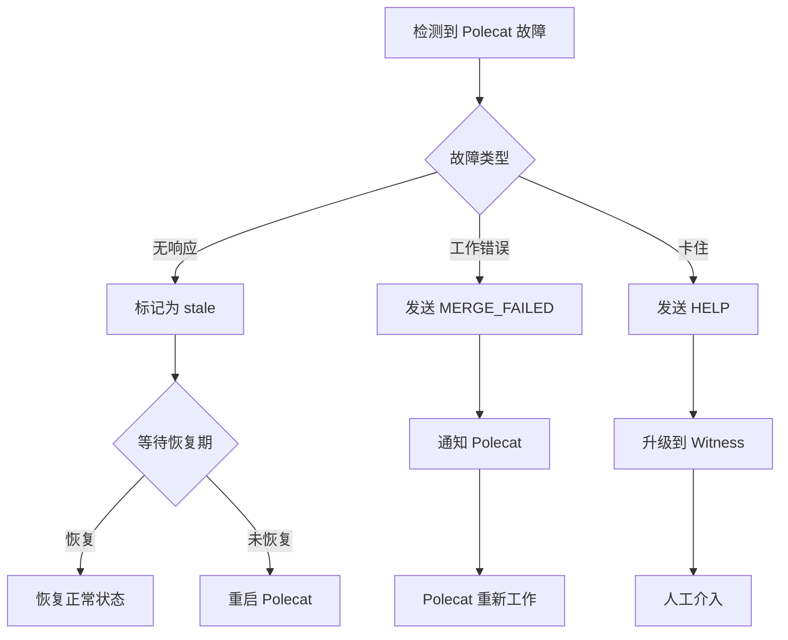

# 故障恢复

> **Level 3** ⭐⭐⭐ | 进阶分析
>
> 本文档深入讲解 Gas Town 的故障恢复机制和 NDI 原则。

## 学习目标

完成本章节学习后，你将能够：

### 基础目标
- 理解 NDI（非确定性幂等性）原则
- 掌握各级故障的恢复策略
- 知道如何处理常见故障场景

### 进阶目标
- 分析监控和检测机制
- 理解自动恢复的边界
- 掌握故障隔离和升级策略

### 专家目标
- 设计类似的容错系统
- 实现自定义恢复策略
- 优化故障检测和恢复性能

---

## 第一部分：NDI 原则

### 什么是 NDI？

**NDI（Nondeterministic Idempotence）**：通过编排确保最终一致性，而非依赖单个操作的可靠性。

### 核心思想

```
传统系统:
├── 强一致性
├── 事务性保证
└── 操作必须可靠

Gas Town (NDI):
├── 最终一致性
├── 持久化状态
└── 监控与恢复
```

### 实现策略

```
策略一：状态持久化
├── 所有状态存储在 Dolt 中
└── 智能体重启可从存储恢复

策略二：监控与恢复
├── Witness 监控 Polecat
├── Deacon 监控系统健康
└── 异常时自动触发恢复

策略三：幂等操作
├── 重复执行同操作不产生副作用
└── 每个操作可安全重试
```

---

## 第二部分：故障分类

### 按层级分类

| 层级 | 故障类型 | 检测方式 | 恢复策略 |
|------|----------|----------|----------|
| **Polecat** | 无响应、工作错误 | Witness 心跳 | 重启或重新分配 |
| **Witness** | Patrol 失败 | Deacon 监控 | 重启 Witness |
| **Refinery** | 合并失败 | 邮件通知 | 重新处理 |
| **Deacon** | 无响应 | Witness Ping | 升级到 Mayor |
| **Mayor** | 无法决策 | 人类检测 | 人工干预 |

### 按严重程度分类

```
Level 1: 瞬时故障
├── 网络抖动
├── 临时锁冲突
└── 自动重试可解决

Level 2: 智能体故障
├── 智能体崩溃
├── 会话超时
└── 重启智能体可解决

Level 3: 系统故障
├── Dolt 服务器故障
├── 磁盘空间不足
└── 需要人工干预

Level 4: 灾难故障
├── 数据损坏
├── 网络分区
└── 需要灾难恢复
```

---

## 第三部分：Polecat 故障恢复

### 故障类型

| 类型 | 症状 | 原因 | 恢复方式 |
|------|------|------|----------|
| **无响应** | 无心跳 | 崩溃/网络 | 重启 |
| **工作错误** | MERGE_FAILED | 代码问题 | 重新工作 |
| **卡住** | 状态不变 | 等待输入 | 人工介入 |
| **Zombie** | 已完成但未清理 | gt done 未执行 | 强制清理 |

### Witness 监控机制

```bash
# Witness 的 Polecat 健康检查
check_polecat_health() {
    for polecat in $(list_polecats); do
        # 1. 检查心跳
        last_heartbeat=$(get_last_heartbeat $polecat)
        if [ $((now - last_heartbeat)) -gt $TIMEOUT ]; then
            mark_polecat_stale $polecat
        fi

        # 2. 检查工作进度
        if [ $(get_progress $polecat) = "stuck" ]; then
            escalate_polecat $polecat
        fi
    done
}
```

### 恢复流程



### 强制清理

```bash
# 清理卡住的 Polecats
gt polecat cleanup --rig gastown --stuck

# 清理特定 Polecat
gt polecat cleanup toast-1 --rig gastown --force

# 清理所有僵尸 Polecats
gt polecat cleanup --rig gastown --zombies
```

---

## 第四部分：Witness 故障恢复

### Deacon 监控

```bash
# Deacon 监控 Witness 健康
check_witness_health() {
    for witness in $(list_witnesses); do
        # 1. 接收 WITNESS_PING
        if [ $(time_since_last_ping $witness) -gt $TIMEOUT ]; then
            mark_witness_down $witness
        fi

        # 2. 检查 patrol 周期
        if [ $(get_last_patrol $witness) -gt $PATROL_TIMEOUT ]; then
            restart_witness_patrol $witness
        fi
    done
}
```

### Witness 重启

```bash
# 检查 Witness 状态
gt witness status --rig gastown

# 重启 Witness
gt witness restart --rig gastown

# 如果无法重启
gt witness reset --rig gastown
```

### 状态恢复

```bash
# Witness 重启后恢复状态
gt witness recover --rig gastown

# 这会：
# 1. 重新加载配置
# 2. 检查 Polecats 状态
# 3. 恢复 patrol 循环
# 4. 处理积压邮件
```

---

## 第五部分：Refinery 故障恢复

### 合并失败处理

| 失败类型 | 症状 | 处理 |
|----------|------|------|
| **测试失败** | CI 失败 | 通知 Polecat 修复 |
| **构建失败** | 编译错误 | 通知 Polecat 修复 |
| **冲突** | Git 冲突 | 发送 REWORK_REQUEST |
| **推送失败** | 网络问题 | 重试推送 |

### 重试机制

```bash
# Refinery 自动重试配置
gt refinery config --retry-count=3
gt refinery config --retry-delay=60
```

### 手动干预

```bash
# 查看合并队列
gt refinery queue --rig gastown

# 手动触发合并
gt refinery process <queue-item>

# 跳过队列项
gt refinery skip <queue-item>

# 清空队列
gt refinery clear --rig gastown
```

---

## 第六部分：Deacon 故障恢复

### 二阶监控

```
Witness ──WITNESS_PING──> Deacon
                          │
                          │ 无响应
                          ▼
                        Witness
                          │
                          │ 升级
                          ▼
                        Mayor
                          │
                          │ 通知
                          ▼
                        人类
```

### Deacon 重启

```bash
# 检查 Deacon 状态
gt deacon status

# 重启 Deacon
gt deacon restart

# 完全重置
gt deacon reset
```

### Boot 狗的作用

```
Boot 狗每 5 分钟检查 Deacon:

1. 检查进程是否存活
2. 检查是否响应 ping
3. 如果无响应，重启 Deacon
4. 如果重启失败，升级到 Mayor
```

---

## 第七部分：系统级故障

### Dolt 服务器故障

```bash
# 检查 Dolt 状态
gt dolt status

# 重启 Dolt 服务器
gt dolt restart

# 如果无法启动
gt dolt reset --force
```

### 磁盘空间不足

```bash
# 检查磁盘使用
gt doctor --disk

# 清理旧数据
gt cleanup --older-than=30d

# 清理已完成的 molecules
bd mol cleanup --completed
```

### Tmux 会话问题

```bash
# 列出所有会话
gt tmux list

# 清理死会话
gt tmux cleanup --dead

# 重启 tmux 服务器
gt tmux restart
```

---

## 第八部分：灾难恢复

### 备份策略

```bash
# Dolt 备份
dolt backup create

# Git 备份
git push origin --all

# 配置备份
gt config backup
```

### 恢复流程

```bash
# 1. 恢复 Dolt 数据
dolt backup restore <backup-name>

# 2. 验证数据
bd verify
gt doctor

# 3. 重启服务
gt deacon start
gt refinery start --all-rigs

# 4. 恢复 Polecats
gt polecat recover --all
```

### 故障转移

```bash
# 在备用 Town 上
gt town promote --primary-down

# 重新平衡 Rigs
gt rig rebalance --from=<failed-town>
```

---

## 第九部分：最佳实践

### 监控配置

```bash
# 设置健康检查间隔
gt config health.check_interval 60

# 设置超时阈值
gt config health.polecat_timeout 300
gt config health.witness_timeout 600

# 设置重试策略
gt config recovery.max_retries 3
gt config recovery.retry_delay 30
```

### 告警设置

```bash
# 配置告警
gt alert set --type=polecat_stuck --channel=slack
gt alert set --type=witness_down --channel=email
gt alert set --type=disk_full --priority=critical
```

### 定期维护

```bash
# 每日健康检查
gt doctor

# 每周清理
gt cleanup --weekly

# 每月备份
gt backup --monthly
```

---

## 延伸阅读

- [升级系统设计](../design/escalation-system.md)
- [看门狗链设计](../design/watchdog-chain.md)
- [故障排查指南](../troubleshooting.md)
