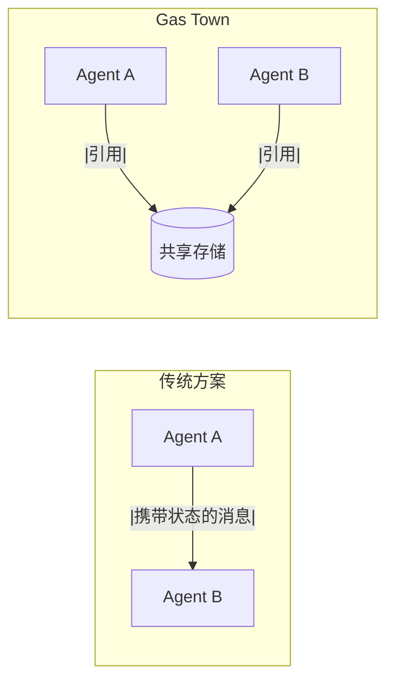

# 架构设计决策

> **Level 4** ⭐⭐⭐⭐ | 专家级文档
>
> 本文档深入分析 Gas Town 的核心架构决策、设计权衡和历史演进。适合架构师、技术决策者和希望深入理解系统设计的开发者。

## 学习目标

完成本章节学习后，你将能够：

### 基础目标
- 理解 Gas Town 核心架构设计的历史背景和决策依据
- 掌握两级架构分离的设计原理
- 理解为什么选择 Dolt 作为存储后端

### 进阶目标
- 分析架构决策中的权衡取舍
- 理解分布式系统中的一致性与可用性权衡
- 掌握大规模智能体协调的设计模式

### 专家目标
- 为类似多智能体系统做出架构设计决策
- 评估 Gas Town 架构的适用边界和扩展方向
- 理解联邦化和插件系统的设计原理

---

## 第一部分：设计哲学

### 问题背景

在构建 Gas Town 之前，我们观察到了 AI 编码助手在大规模部署时的核心问题：

| 挑战 | 传统方案 | 问题 |
|------|----------|------|
| **上下文丢失** | 单个 AI 实例 | 会话重启后所有上下文丢失 |
| **手动协调** | 人工分配任务 | 4-10 个智能体后变得混乱 |
| **状态孤立** | 各自维护状态 | 无法追踪跨智能体的工作进度 |
| **容错能力** | 失败后手动恢复 | 单点故障导致整体停滞 |

### Gas Town 的核心洞察

**洞察一：状态持久化比状态传递更重要**

传统分布式系统通过消息传递状态。Gas Town 发现：对于 AI 智能体，将状态持久化到共享存储中，比在消息中传递更可靠。



**设计决策**：所有工作状态存储在 Beads（Dolt 数据库）中，智能体之间只传递引用（bead ID）。

**洞察二：两级分离实现职责清晰**

将协调层（Town）与执行层（Rig）分离，使得：

1. **单一协调者**（Mayor）可以统筹多个项目
2. **每个项目**（Rig）有独立的监控和合并流程
3. **故障隔离**：一个 Rig 的问题不影响其他 Rig

---

## 第二部分：两级架构决策

### 为什么需要两级？

**设计决策**：将系统分为 Town 级（跨 Rig 协调）和 Rig �（项目执行）

| 层级 | 范围 | 职责 | 数据存储 |
|------|------|------|----------|
| **Town** | `~/gt/` | 跨项目协调、智能体管理 | `~/.beads/` (`hq-*` 前缀) |
| **Rig** | `<rig>/mayor/rig/` | 项目执行、代码合并 | `<rig>/.beads/` (项目前缀) |

### 权衡分析

**两级架构的优势**：

```
优势一：职责清晰
├── Town 专注于协调
└── Rig  专注于执行

优势二：故障隔离
├── Rig 故障不影响其他 Rig
└── Town 故障时各 Rig 可独立运行

优势三：可扩展性
├── 新增 Rig 不影响 Town 逻辑
└── 可灵活调整 Rig 资源分配
```

**两级架构的代价**：

```
代价一：复杂性增加
├── 需要维护两层路由规则
└── 跨层操作需要转发

代价二：数据一致性
├── Town 和 Rig 的数据需要同步
└── 路由表维护成为新的复杂性来源

代价三：运维成本
├── 需要监控两层健康状态
└── 故障排查需要跨层级分析
```

### 路由设计

为了解决两级架构的寻址问题，Gas Town 设计了基于前缀的路由系统：

```jsonl
{"prefix":"hq-","path":"."}
{"prefix":"gt-","path":"gastown/mayor/rig"}
{"prefix":"bd-","path":"beads/mayor/rig"}
```

**设计考量**：

1. **前缀即位置**：通过 bead ID 前缀即可定位存储位置
2. **相对路径**：路由使用相对于 Town 根目录的路径
3. **透明转发**：`bd` 命令自动处理跨层操作

**为什么不用中央服务发现？**

| 方案 | 优势 | 劣势 | 选择 |
|------|------|------|------|
| **前缀路由** | 简单、无单点、文件系统可读 | 需要手动维护路由表 | ✅ 采用 |
| **服务发现** | 自动、动态 | 引入新组件、增加复杂度 | ❌ 未采用 |

---

## 第三部分：存储后端决策

### 演进历史

Gas Town 的存储后端经历了三次重大演进：

```
v1: SQLite (嵌入式)
    ↓
v2: JSONL + Git (文件系统)
    ↓
v3: Dolt (SQL Server) ← 当前版本
```

### 为什么放弃 SQLite？

**问题**：嵌入式 Dolt 使用文件级锁定（noms LOCK）

在多智能体环境下：

```bash
# gt status 会为检查所有 rig 生成 40+ 个 bd 进程
# 每个进程都竞争同一个锁文件
# 结果：进程无限期挂起等待
```

**尝试的方案**：

1. **信号量限制**（`MaxConcurrentBd=3`）
   - 结果：串行化访问，杀死了并行性

2. **保留嵌入式作为后备**
   - 结果：增加复杂度，且服务器数据与嵌入式不兼容

**最终决策**：完全移除嵌入式模式，只保留服务器模式

### 为什么选择 Dolt Server？

| 特性 | Dolt Server | SQLite | JSONL+Git |
|------|-------------|--------|-----------|
| **并发支持** | ✅ 多客户端 | ❌ 文件锁 | ❌ Git 冲突 |
| **版本控制** | ✅ 内置 | ❌ | ✅ Git |
| **SQL 查询** | ✅ 完整 | ✅ 完整 | ❌ 需解析 |
| **分支** | ✅ Dolt 分支 | ❌ | ✅ Git 分支 |
| ** forensics** | ✅ `AS OF` 查询 | ❌ | ✅ Git 历史 |
| **性能** | 高 | 中 | 低 |

**Dolt Server 架构**：

```
┌─────────────────────────────────┐
│  Dolt SQL Server (每 Town 一个)   │
│  - 端口 3307                      │
│  - 服务所有 rig 数据库            │
│  - 多客户端并发                   │
│  - 由 gt daemon 管理              │
│  - 自动启动、自动重启             │
└─────────────────────────────────┘
           │
           ├── hq/       (Town 级 beads)
           ├── gastown/  (gt-* 前缀)
           ├── beads/    (bd-* 前缀)
           └── ...       (其他 rigs)
```

### 服务器拓扑选择

| 拓扑 | 用途 | 优势 | 劣势 |
|------|------|------|------|
| **每 Town 一服务器** | 默认 | 简单操作 | 单点 |
| **每 Rig 一服务器** | 隔离需求 | Rig 间隔离 | 资源开销 |

**当前选择**：每 Town 一服务器

**理由**：
- 大多数场景下不需要 Rig 间隔离
- 运维简单（一个进程）
- 资源利用率高

---

## 第四部分：三层数据平面

### 为什么需要分层？

早期 Gas Town 将所有数据混在 JSONL 文件中，导致：

1. **操作数据**（高频率变更）污染了 Git 历史
2. **账本数据**（永久记录）被频繁更新淹没
3. **联邦数据**（跨 Town 共享）无法高效同步

**设计决策**：按访问模式将数据分为三层

### Plane 1：操作平面（Operational）

| 属性 | 值 |
|------|-----|
| **用途** | 实时游戏状态 |
| **内容** | 进行中的工作、状态变更、心跳 |
| **变更频率** | 高（秒级） |
| **可变性** | 完全可变 |
| **可见性** | 本地（Town/Rig） |
| **持久性** | 数天到数周 |
| **联邦** | 不联邦 |
| **传输** | Dolt SQL Server |

**Forensics 策略**：

```sql
-- 使用 Dolt 的历史表和 AS OF 查询
SELECT * FROM dolt_history_issues AS OF '2025-01-15 10:30:00'
WHERE id = 'gt-abc123';
```

**关键决策**：不用 Git 进行操作数据 forensics

### Plane 2：账本平面（Ledger）

| 属性 | 值 |
|------|-----|
| **用途** | 永久工作记录 |
| **内容** | 已完成的 issues、合并的 MR、CV 条目 |
| **变更频率** | 低（仅追加） |
| **可变性** | 追加为主，修正为辅 |
| **可见性** | 全局 |
| **持久性** | 永久 |
| **联邦** | 通过 Dolt-in-Git 联邦 |
| **传输** | Dolt 数据库 |

**关键决策**：Dolt-in-Git 发布后替代 JSONL

### Plane 3：联邦平面（Federation）

| 属性 | 值 |
|------|-----|
| **用途** | 跨 Town 共享 |
| **内容** | 公开角色、公式、模板 |
| **变更频率** | 中 |
| **可变性** | 版本化 |
| **可见性** | 全球 |
| **持久性** | 永久 |
| **联邦** | 完全联邦 |
| **传输** | Dolt-in-Git（未来）|

---

## 第五部分：智能体生命周期设计

### Polecat 为什么设计为短命？

**设计决策**：Polecats 完成任务后必须执行 `gt done` 自我清理

**理由**：

```
理由一：资源管理
├── 避免 40+ 个长期运行的智能体占用资源
└── 每个任务都是干净的 slate

理由二：成本控制
├── 短命智能体减少 API 成本
└── 避免空闲智能体的持续计费

理由三：状态管理
├── 每个任务有明确的生命周期
└── 状态存储在 Hook 中，而非智能体中
```

**自我清理流程**：

```bash
gt done
  ├─ 1. 推送分支到 origin
  ├─ 2. 提交工作到合并队列
  ├─ 3. 清理自己的沙盒和会话
  └─ 4. 立即退出
```

### 为什么使用 Git Worktree？

**设计决策**：Polecats 使用 Git worktree 而非完整克隆

**对比**：

| 特性 | Worktree | 完整克隆 |
|------|----------|----------|
| **创建时间** | 秒级 | 分钟级 |
| **磁盘空间** | 共享对象 | 独立对象 |
| **适用场景** | 短命智能体 | 人类开发者 |

**架构**：

```bash
~/gt/<rig>/
├── mayor/rig/              # 规范克隆（worktree 基础）
│   └── .beads/             # Rig 级 beads 数据库
├── refinery/rig/           # mayor/rig 的 worktree
├── crew/<name>/            # 完整克隆（人类工作区）
└── polecats/<name>/        # mayor/rig 的 worktree
```

**关键洞察**：Worktree 基于同一个 `mayor/rig`，实现：
- 快速生成（无需重新克隆）
- 共享存储（对象数据库共享）
- 隔离工作（各自有独立分支）

---

## 第六部分：通信协议设计

### 为什么选择 Mail 而非直接调用？

**设计决策**：智能体间通过异步 Mail 通信，而非直接 RPC

**权衡**：

| 方案 | 优势 | 劣势 | 选择 |
|------|------|------|------|
| **直接 RPC** | 实时、简单 | 紧耦合、同步阻塞 | ❌ |
| **消息队列** | 解耦、可靠 | 引入新组件 | ❌ |
| **Mail (Beads)** | 解耦、可审计、持久化 | 异步延迟 | ✅ |

### Mail 协议设计

**格式规范**：

```
主题行：TYPE_PREFIX: 简要描述
正文：
  Key-Value 结构化数据
  (空行)
  Markdown 自由内容
```

**示例**：

```
POLECAT_DONE nux
Exit: MERGED
Issue: gt-abc123
MR: 42
Branch: polecat/nux-feature-xyz

工作已完成，请审核。
```

**关键设计决策**：

1. **类型前缀大写**：便于解析和识别
2. **结构化+自由形式**：机器可解析，人类可阅读
3. **存储为 Beads**：持久化、可审计、可重放

---

## 第七部分：一致性模型

### NDI：非确定性幂等性

**核心思想**：通过编排确保最终一致性，而非依赖单个操作的可靠性

**实现策略**：

```
策略一：状态持久化
├── 所有状态存储在 Dolt 中
└── 智能体重启可从存储恢复

策略二：监控与恢复
├── Witness 监控 Polecat 健康状态
├── Deacon 监控系统级健康
└── 异常时自动触发恢复流程

策略三：幂等操作
├── 重复执行同操作不产生副作用
└── 每个操作可安全重试
```

### 一致性边界

| 组件 | 一致性模型 | 理由 |
|------|-----------|------|
| **Beads 操作** | 最终一致 | Dolt 提供事务保证 |
| **Mail 投递** | 至少一次 | 可重试，接收者去重 |
| **Git 状态** | 强一致 | Git 原生保证 |
| **Convoy 状态** | 最终一致 | 通过定期检查刷新 |

---

## 第八部分：扩展性设计

### 联邦化架构

**目标**：支持多个独立的 Town 协同工作

**设计**：

```
Town A (公司内网)          Town B (开发环境)
├── hq/                   ├── hq/
├── project-a/            ├── project-b/
└── ...                   └── ...

              (通过 Dolt-in-Git 同步公共数据)
                 ↓
            共享联邦平面
              ├── 公共角色/
              ├── 公共公式/
              └── ...
```

**同步策略**：

1. **Town 级数据**：不同步
2. **Rig 级数据**：按需同步
3. **联邦数据**：完全同步

### 插件系统

**设计决策**：Deacon 通过插件系统扩展功能

**插件类型**：

| 类型 | 用途 | 示例 |
|------|------|------|
| **健康检查** | 监控系统状态 | 磁盘空间、进程健康 |
| **通知** | 发送告警 | Slack、Email |
| **集成** | 外部系统对接 | CI/CD、Issue Tracker |

**插件接口**：

```go
type Plugin interface {
    Name() string
    Execute(ctx context.Context, input interface{}) (output interface{}, err error)
}
```

---

## 第九部分：未解决的设计问题

### 问题一：跨 Town 身份

**挑战**：如何在不引入中心化的情况下实现跨 Town 身份？

**当前方案**：使用 Email 作为全局身份

**未来方向**：考虑 Web of Trust 或联邦身份协议

### 问题二：智能体能力发现

**挑战**：如何动态发现智能体的能力？

**当前方案**：静态配置和命名约定

**未来方向**：能力声明和匹配系统

### 问题三：实时协调

**挑战**：Mail 是异步的，某些场景需要实时协调

**当前方案**：`gt nudge` 提供即时通知

**未来方向**：考虑引入轻量级消息总线

---

## 第十部分：架构演进方向

### 短期（6 个月）

- [ ] Dolt-in-Git 集成完成
- [ ] 联邦平面实现
- [ ] 插件系统标准化

### 中期（1 年）

- [ ] 跨 Town 身份验证
- [ ] 智能体能力动态发现
- [ ] 实时协调机制增强

### 长期（2 年+）

- [ ] 完全联邦化部署
- [ ] 多云支持
- [ ] AI 模型市场

---

## 总结

Gas Town 的架构设计体现了以下核心原则：

1. **状态持久化优于状态传递**：所有状态存储在共享存储中
2. **两级分离实现职责清晰**：Town 协调，Rig 执行
3. **异步通信解耦智能体**：Mail 系统提供可靠、可审计的通信
4. **监控与恢复确保 NDI**：通过编排实现最终一致性
5. **可扩展性内置**：插件系统和联邦化支持

这些决策共同构成了一个可扩展、可靠、可维护的多智能体编排系统。

---

## 延伸阅读

- [Dolt 存储架构](../design/dolt-storage.md)
- [身份与归因](../concepts/identity.md)
- [Mail 协议](../design/mail-protocol.md)
- [智能体生命周期](../concepts/polecat-lifecycle.md)
