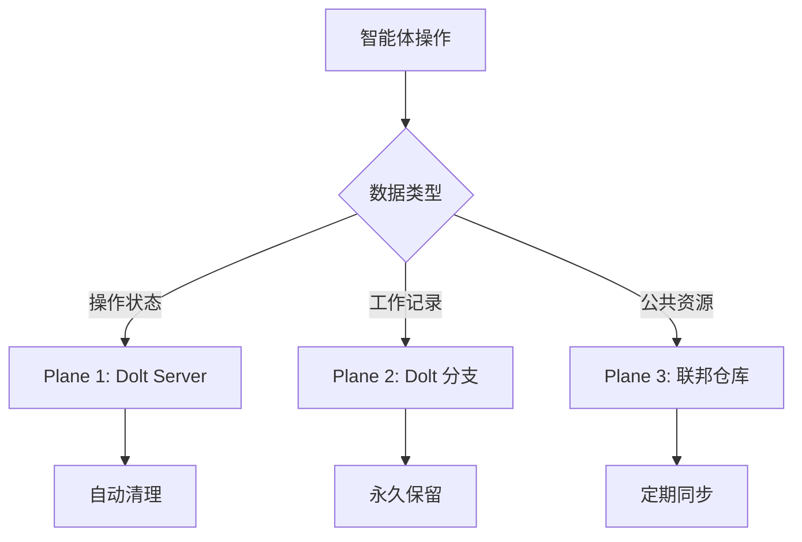
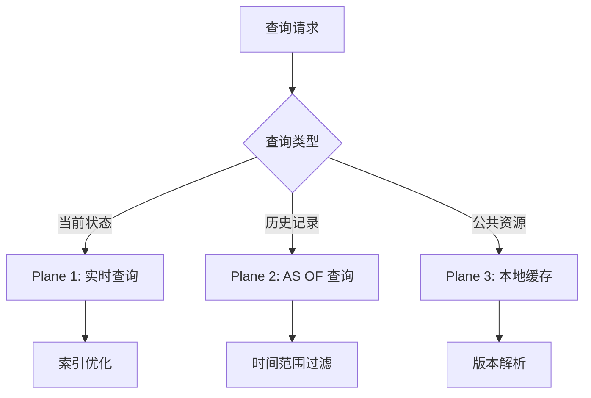

# 数据平面设计

> **Level 4** ⭐⭐⭐⭐ | 专家级文档
>
> 本文档深入分析 Gas Town 的三层数据平面架构，这是实现可扩展性和性能优化的核心设计。

## 学习目标

完成本章节学习后，你将能够：

### 基础目标
- 理解为什么需要将数据分为三层
- 掌握每一层的特点和用途
- 理解 Dolt 如何支持不同的数据访问模式

### 进阶目标
- 分析数据分层的权衡取舍
- 理解 forensics 策略的设计
- 掌握联邦数据的同步机制

### 专家目标
- 为类似系统设计数据分层架构
- 优化数据访问性能
- 设计跨组织的联邦数据同步

---

## 第一部分：为什么需要数据分层？

### 早期设计的问题

Gas Town 最初将所有数据混在 JSONL 文件中：

```
problems/
├── 操作数据（高频率变更）污染了 Git 历史
├── Git 无法高效查询结构化数据
├── JSONL 解析比 SQL 慢
└── 无法实现跨 Town 的联邦同步
```

### 核心洞察

**不同数据有不同的访问模式**：

| 数据类型 | 变更频率 | 查询模式 | 持久性需求 | 联邦需求 |
|----------|----------|----------|------------|----------|
| 操作状态 | 秒级 | 随机读写 | 数天 | 不需要 |
| 工作记录 | 每天 | 时间范围查询 | 永久 | 选择性 |
| 公共模板 | 每周 | 版本比较 | 永久 | 完全 |

**设计决策**：按访问模式将数据分为三层

---

## 第二部分：Plane 1 - 操作平面

### 用途定义

操作平面是**"实时游戏状态"**——进行中的工作、状态变更、分配、patrol 结果、molecule 转换、心跳。

### 数据特性

| 属性 | 值 | 设计含义 |
|------|-----|----------|
| **变更频率** | 高（秒级） | 需要低延迟写入 |
| **可变性** | 完全可变 | 不需要版本控制 |
| **可见性** | 本地（Town/Rig） | 不需要联邦 |
| **持久性** | 数天到数周 | 可自动清理 |
| **查询模式** | 随机访问 | 需要索引优化 |

### 存储实现

**后端**：Dolt SQL Server

**表结构**：

```sql
-- 操作状态表
CREATE TABLE operational_state (
    id VARCHAR(255) PRIMARY KEY,
    rig VARCHAR(255) NOT NULL,
    state JSON NOT NULL,
    updated_at TIMESTAMP DEFAULT CURRENT_TIMESTAMP,
    INDEX idx_rig_updated (rig, updated_at)
);

-- 心跳表
CREATE TABLE heartbeats (
    agent VARCHAR(255) NOT NULL,
    timestamp TIMESTAMP DEFAULT CURRENT_TIMESTAMP,
    status JSON NOT NULL,
    INDEX idx_agent_time (agent, timestamp)
);
```

### Forensics 策略

**关键决策**：不用 Git 进行操作数据 forensics

**替代方案**：使用 Dolt 的历史功能

```sql
-- 查询历史状态
SELECT * FROM dolt_history_operational_state
AS OF '2025-01-15 10:30:00'
WHERE id = 'gt-abc123';

-- 查看变更历史
SELECT * FROM dolt_history_operational_state
WHERE id = 'gt-abc123'
ORDER BY committed_at DESC;
```

**优势**：
- SQL 查询比 Git 日志更灵活
- 支持时间点查询（`AS OF`）
- 不污染 Git 历史

### 自动清理

```go
// 自动清理旧操作数据的配置
type OperationalCleanupConfig struct {
    RetentionDays    int    // 保留天数（默认：7）
    CleanupInterval  time.Duration // 清理间隔（默认：1小时）
    BatchSize        int    // 批次大小（默认：1000）
}

// 清理逻辑
func CleanupOldData(db *dolt.DB, config OperationalCleanupConfig) error {
    cutoff := time.Now().AddDate(0, 0, -config.RetentionDays)
    query := "DELETE FROM operational_state WHERE updated_at < ?"
    _, err := db.Exec(query, cutoff)
    return err
}
```

---

## 第三部分：Plane 2 - 账本平面

### 用途定义

账本平面是**"永久工作记录"**——已完成的 issues、合并的 MR、CV 条目。

### 数据特性

| 属性 | 值 | 设计含义 |
|------|-----|----------|
| **变更频率** | 低（仅追加） | 优化写入吞吐量 |
| **可变性** | 追加为主，修正为辅 | 大部分不可变 |
| **可见性** | 全局 | 需要跨 Rig 访问 |
| **持久性** | 永久 | 从不删除 |
| **查询模式** | 时间范围、聚合 | 需要分析索引 |

### 存储实现

**后端**：Dolt 数据库（带版本控制）

**表结构**：

```sql
-- Issues 表（核心账本）
CREATE TABLE issues (
    id VARCHAR(255) PRIMARY KEY,
    type VARCHAR(50) NOT NULL,
    title TEXT NOT NULL,
    status VARCHAR(50) NOT NULL,
    created_by VARCHAR(255) NOT NULL,
    created_at TIMESTAMP NOT NULL,
    completed_at TIMESTAMP,
    owner VARCHAR(255),
    metadata JSON,
    INDEX idx_status (status),
    INDEX idx_created_by (created_by),
    INDEX idx_created_at (created_at)
);

-- CV 条目表
CREATE TABLE cv_entries (
    id VARCHAR(255) PRIMARY KEY,
    owner_email VARCHAR(255) NOT NULL,
    bead_id VARCHAR(255) NOT NULL,
    activity_type VARCHAR(100) NOT NULL,
    timestamp TIMESTAMP NOT NULL,
    metadata JSON,
    INDEX idx_owner_email (owner_email),
    INDEX idx_timestamp (timestamp)
);
```

### Dolt 分支策略

```bash
# 主分支：权威账本
dolt checkout main

# 每个智能体有工作分支
dolt checkout -b gastown/polecats/toast

# 智能体完成后合并到主分支
dolt checkout main
dolt merge gastown/polecats/toast
```

### Dolt-in-Git 迁移

**当前状态**：使用 Dolt Server

**未来**：Dolt-in-Git 发布后

```bash
# 迁移后的结构
.git/
├── dolt/              # Dolt 数据（Git 管理）
│   ├── noms/          # 内容寻址存储
│   └── refs/          # 分支引用
└── .beads/            # Beads 元数据

# 优势
├── Git 原生分布式
├── 无需单独的 Dolt Server
└── Git 工具链兼容
```

---

## 第四部分：Plane 3 - 联邦平面

### 用途定义

联邦平面是**"跨 Town 共享"**——公开角色、公式、模板。

### 数据特性

| 属性 | 值 | 设计含义 |
|------|-----|----------|
| **变更频率** | 中 | 需要版本控制 |
| **可变性** | 版本化 | 支持分支 |
| **可见性** | 全球 | 完全联邦 |
| **持久性** | 永久 | 从不删除 |
| **查询模式** | 按名称/版本 | 需要缓存 |

### 存储实现

**当前**：通过 Git 仓库手动同步

**未来（Dolt-in-Git）**：

```bash
# 联邦数据仓库
git@federation.example:federal-data.git

# 每个 Town 作为远程
git remote add federation git@federation.example:federal-data.git

# 同步
git pull federation main
git push federation main
```

### 联邦数据结构

```
federal-data/
├── roles/                    # 公共角色定义
│   ├── hq-mayor-role.toml
│   ├── hq-witness-role.toml
│   └── hq-polecat-role.toml
│
├── formulas/                 # 公共公式
│   ├── mol-polecat-work.formula.toml
│   ├── mol-witness-patrol.formula.toml
│   └── release-checklist.formula.toml
│
├── templates/                # 模板库
│   ├── agent-prompts/
│   ├── project-templates/
│   └── workflow-templates/
│
└── config/                   # 配置模式
    ├── rig-schema.json
    └── validation-rules.yaml
```

### 同步协议

**拉取策略**：

```bash
# 每小时自动拉取
gt federation pull

# 策略
# 1. 获取远程更改
# 2. 检测冲突
# 3. 自动合并（无冲突时）
# 4. 标记需要人工解决的冲突
```

**推送策略**：

```bash
# 手动推送经过审查的更改
gt federation push --review

# 审查流程
# 1. 本地测试
# 2. 创建 PR 到联邦仓库
# 3. 代码审查
# 4. 合并后其他 Town 可拉取
```

---

## 第五部分：数据流设计

### 写入路径



### 读取路径



### 跨平面查询

```sql
-- 复杂查询：结合操作状态和工作记录
SELECT
    i.id,
    i.title,
    i.status,
    o.state as current_progress,
    i.created_by
FROM issues i
LEFT JOIN operational_state o ON i.id = o.id
WHERE i.status IN ('in_progress', 'pending')
ORDER BY i.created_at DESC;
```

---

## 第六部分：性能优化

### 索引策略

**操作平面索引**：

```sql
-- 高频查询优化
CREATE INDEX idx_agent_status ON operational_state(agent, status);
CREATE INDEX idx_rig_timestamp ON operational_state(rig, updated_at DESC);
CREATE INDEX idx_patrol_cycle ON heartbeats(agent, cycle_number);
```

**账本平面索引**：

```sql
-- 分析查询优化
CREATE INDEX idx_owner_time ON cv_entries(owner_email, timestamp);
CREATE INDEX idx_bead_type ON issues(bead_id, type);
CREATE INDEX idx_completion_month ON issues(
    YEAR(completed_at),
    MONTH(completed_at)
);
```

### 查询优化

**批量查询**：

```go
// 不推荐：逐个查询
for _, id := range beadIDs {
    bead, _ := db.GetBead(id)
    process(bead)
}

// 推荐：批量查询
beads, _ := db.GetBeads(beadIDs)
for _, bead := range beads {
    process(bead)
}
```

**连接池**：

```go
// 连接池配置
type DoltPoolConfig struct {
    MaxOpenConns    int           // 最大打开连接（默认：25）
    MaxIdleConns    int           // 最大空闲连接（默认：5）
    ConnMaxLifetime time.Duration // 连接最大生命周期（默认：1小时）
    ConnMaxIdleTime time.Duration // 连接最大空闲时间（默认：10分钟）
}
```

### 缓存策略

**分层缓存**：

```
L1: 应用内存缓存
├── 热点 bead（当前 Convoy）
└── TTL: 5 分钟

L2: Dolt 查询缓存
├── 常用查询（agent list、status）
└── TTL: 15 分钟

L3: Dolt 页面缓存
├── 数据库内置缓存
└── 自动管理
```

---

## 第七部分：数据迁移

### JSONL 到 Dolt 迁移

**迁移脚本**：

```bash
# 1. 导出 JSONL 到临时文件
bd export --format jsonl > /tmp/beads-backup.jsonl

# 2. 导入到 Dolt
bd import --file /tmp/beads-backup.jsonl

# 3. 验证数据完整性
bd verify --compare /tmp/beads-backup.jsonl

# 4. 切换到 Dolt 后端
gt config storage.backend dolt
gt config storage.port 3307
```

### Dolt-in-Git 迁移计划

```bash
# 迁移步骤（Dolt-in-Git 发布后）
# 1. 备份现有 Dolt 数据库
dolt backup create

# 2. 初始化 Git 仓库
git init
git add .
git commit -m "Initial commit"

# 3. 启用 Dolt-in-Git
dolt config set dolt.enable_in_git true

# 4. 验证
dolt status
git status
```

---

## 第八部分：监控与告警

### 关键指标

| 指标 | Plane 1 | Plane 2 | Plane 3 |
|------|---------|---------|---------|
| **查询延迟** | < 10ms | < 100ms | < 50ms |
| **写入吞吐** | > 1000/s | > 100/s | > 10/s |
| **存储增长** | ~100MB/天 | ~10MB/天 | ~1MB/天 |
| **数据保留期** | 7 天 | 永久 | 永久 |

### 告警规则

```yaml
alerts:
  - name: dolt_latency_high
    condition: avg_query_latency > 100ms
    severity: warning
    action: notify_slack

  - name: operational_data_growth
    condition: daily_growth > 200MB
    severity: warning
    action: review_retention_policy

  - name: dolt_server_down
    condition: server_not_responsive
    severity: critical
    action: restart_daemon
```

---

## 延伸阅读

- [Dolt 存储架构](../design/dolt-storage.md)
- [数据层属性](../design/property-layers.md)
- [运营状态](../design/operational-state.md)
