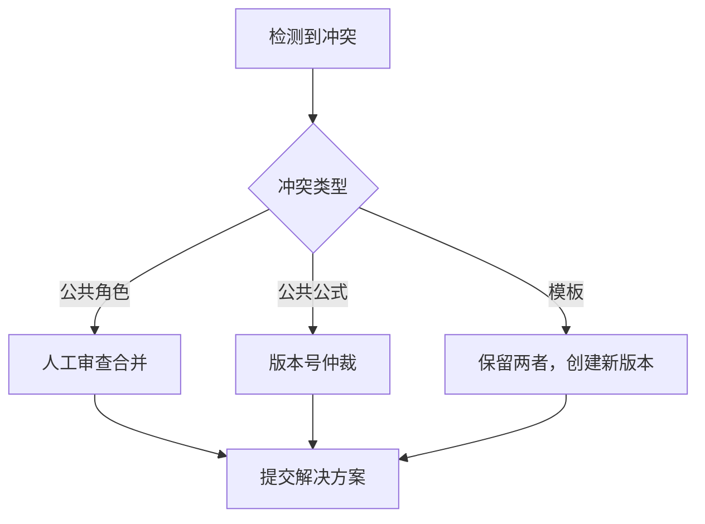
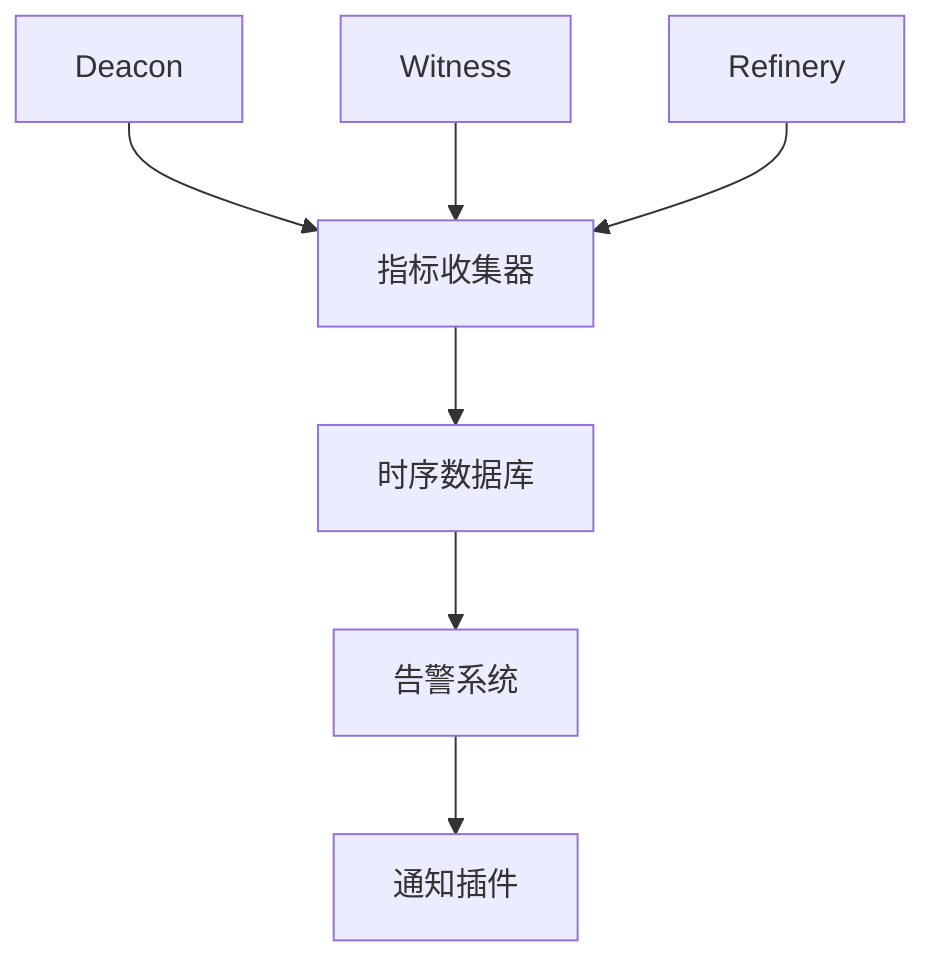

# 扩展性与联邦化设计

> **Level 4** ⭐⭐⭐⭐ | 专家级文档
>
> 本文档深入分析 Gas Town 的扩展性架构，包括联邦化部署、插件系统和大规模协调机制。

## 学习目标

完成本章节学习后，你将能够：

### 基础目标
- 理解 Gas Town 的联邦化架构设计
- 掌握插件系统的扩展机制
- 理解大规模智能体协调的策略

### 进阶目标
- 分析跨 Town 同步的数据流设计
- 理解插件系统的接口和生命周期
- 掌握性能扩展的瓶颈和优化方向

### 专家目标
- 设计多 Town 联邦部署方案
- 开发自定义插件扩展 Deacon 功能
- 构建跨组织的智能体协作网络

---

## 第一部分：联邦化架构

### 为什么需要联邦化？

**场景**：大型组织可能有多个独立的 Gas Town 部署

| 部署 | 位置 | 用途 |
|------|------|------|
| **Town A** | 公司内网 | 生产项目 |
| **Town B** | 开发环境 | 实验性项目 |
| **Town C** | 云端 VPC | 合作伙伴项目 |

**挑战**：如何在这些独立的 Town 之间共享数据和协作？

### 联邦化设计原则

```
原则一：Town 自治
├── 每个 Town 独立运行
└── 不依赖中心服务

原则二：选择性同步
├── 不同步敏感数据
└── 只同步需要共享的数据

原则三：最终一致性
├── 允许短暂的差异
└── 通过定期同步收敛
```

### 联邦化架构图

```
┌─────────────────────┐    ┌─────────────────────┐    ┌─────────────────────┐
│     Town A (内网)     │    │     Town B (开发)    │    │     Town C (云端)    │
│  ┌─────────────────┐ │    │  ┌─────────────────┐ │    │  ┌─────────────────┐ │
│  │ hq/ (私有)      │ │    │  │ hq/ (私有)      │ │    │  │ hq/ (私有)      │ │
│  │ project-a/      │ │    │  │ experiment-1/   │ │    │  │ partner-x/      │ │
│  │ project-b/      │ │    │  │ experiment-2/   │ │    │  │ partner-y/      │ │
│  └─────────────────┘ │    │  └─────────────────┘ │    │  └─────────────────┘ │
└─────────┬───────────┘    └─────────┬───────────┘    └─────────┬───────────┘
          │                          │                          │
          └──────────────────────────┼──────────────────────────┘
                                     │
                             (Dolt-in-Git 同步)
                                     ↓
                        ┌─────────────────────────┐
                        │     共享联邦平面         │
                        │  ├── 公共角色/          │
                        │  ├── 公共公式/          │
                        │  └── 模板库/            │
                        └─────────────────────────┘
```

---

## 第二部分：数据联邦策略

### 三层数据联邦

| 数据层 | 同步策略 | 理由 |
|--------|----------|------|
| **操作平面** | 不同步 | 高频变更、本地状态 |
| **账本平面** | 按需同步 | 工作记录、选择性共享 |
| **联邦平面** | 完全同步 | 公共资源、需要一致性 |

### 同步机制

**Dolt-in-Git 同步**：

```bash
# 联邦数据存储在 Git 仓库中
# 每个 Town 定期拉取和推送

# 在 Town A 中
gt federation pull    # 从远程拉取联邦数据更新
gt federation push     # 推送本地联邦数据更改

# 远程 Git 仓库作为真相源
git@federation.example:federal-data.git
```

### 冲突解决策略



---

## 第三部分：插件系统

### 为什么需要插件？

Deacon 作为守护进程，需要灵活扩展功能：

| 需求类型 | 示例 | 是否需要插件 |
|----------|------|--------------|
| **核心健康检查** | 进程存活、磁盘空间 | ❌ 内置 |
| **通知集成** | Slack、Email、Webhook | ✅ 插件 |
| **外部系统对接** | Jira、GitHub Issues | ✅ 插件 |
| **自定义监控** | 业务指标检查 | ✅ 插件 |

### 插件接口设计

```go
// Plugin 是所有 Deacon 插件必须实现的接口
type Plugin interface {
    // Name 返回插件唯一名称
    Name() string

    // Execute 执行插件逻辑
    Execute(ctx context.Context, input interface{}) (output interface{}, err error)

    // Init 可选：插件初始化
    Init(config map[string]interface{}) error

    // Cleanup 可选：清理资源
    Cleanup() error
}
```

### 插件类型

#### 1. 健康检查插件

```go
type HealthCheckPlugin struct {
    name     string
    checks   []CheckFunc
    interval time.Duration
}

func (p *HealthCheckPlugin) Execute(ctx context.Context, input interface{}) (interface{}, error) {
    results := make([]CheckResult, len(p.checks))
    for i, check := range p.checks {
        results[i] = check()
    }
    return results, nil
}
```

**内置检查**：
- 磁盘空间（低于阈值告警）
- Dolt 服务器状态
- Tmux 会话健康
- Git 仓库状态

#### 2. 通知插件

```go
type NotificationPlugin struct {
    name     string
    channels []NotificationChannel
}

func (p *NotificationPlugin) Execute(ctx context.Context, input interface{}) (interface{}, error) {
    msg := input.(AlertMessage)
    for _, ch := range p.channels {
        ch.Send(ctx, msg)
    }
    return nil, nil
}
```

**支持的通知渠道**：
- Slack Webhook
- Email
- PagerDuty
- 自定义 Webhook

#### 3. 集成插件

```go
type IntegrationPlugin struct {
    name        string
    client      APIClient
    transformer Transformer
}

func (p *IntegrationPlugin) Execute(ctx context.Context, input interface{}) (interface{}, error) {
    // 将 Beads 事件转换为外部系统格式
    external := p.transformer(input)
    return p.client.Create(ctx, external)
}
```

**支持的外部系统**：
- Jira
- GitHub Issues
- Linear
- Asana

### 插件配置

**配置文件位置**：`~/gt/deacon/plugins.yaml`

```yaml
plugins:
  - name: slack-alerts
    type: notification
    enabled: true
    config:
      webhook_url: "${SLACK_WEBHOOK_URL}"
      channel: "#alerts"
      severity: ["error", "critical"]

  - name: jira-sync
    type: integration
    enabled: true
    config:
      base_url: "https://jira.example.com"
      project: "GT"
      username: "${JIRA_USERNAME}"
      api_token: "${JIRA_API_TOKEN}"

  - name: disk-space-check
    type: health-check
    enabled: true
    config:
      threshold_percent: 80
      check_interval: "5m"
```

---

## 第四部分：大规模协调

### 协调层次

Gas Town 实现三层协调机制：

```
┌─────────────────────────────────────────────────────────┐
│                   第三层：Town 间协调                    │
│              (联邦化、跨组织协作)                        │
└─────────────────────────────────────────────────────────┘
                            ↑
┌─────────────────────────────────────────────────────────┐
│                   第二层：Town 内协调                     │
│            (Mayor、Deacon、跨 Rig 协调)                  │
└─────────────────────────────────────────────────────────┘
                            ↑
┌─────────────────────────────────────────────────────────┐
│                   第一层：Rig 内协调                      │
│         (Witness、Refinery、Polecat 管理)               │
└─────────────────────────────────────────────────────────┘
```

### 性能瓶颈分析

| 层级 | 潜在瓶颈 | 扩展策略 |
|------|----------|----------|
| **Rig 层** | 单 Rig Polecat 数量 | 增加 Rig 数量 |
| **Town 层** | Mayor 决策速度 | 分布式 Mayor |
| **联邦层** | 跨 Town 同步延迟 | 增量同步、CDN |

### 扩展模式

#### 模式一：水平扩展（增加 Rig）

```
适用场景：更多项目，而非更大项目

策略：
├── 每个项目一个独立 Rig
├── Town 协调不变
└── 线性扩展能力

限制：
├── Mayor 协调能力上限
└── Town 资源上限
```

#### 模式二：垂直扩展（增加 Polecat）

```
适用场景：单个项目需要更多并行度

策略：
├── 在单 Rig 内增加 Polecat
├── Witness 和 Refinery 自动扩展
└── 通过 Convoy 批量分配

限制：
├── Git 仓库冲突概率增加
├── Refinery 合并队列压力
└── 单机资源上限
```

#### 模式三：联邦扩展（增加 Town）

```
适用场景：跨组织协作、地理分布

策略：
├── 每个组织/区域独立 Town
├── 通过联邦平面共享资源
└── 异步协作模式

限制：
├── 跨 Town 延迟
└── 联邦数据一致性
```

---

## 第五部分：性能优化

### Dolt 性能优化

| 优化项 | 问题 | 解决方案 | 效果 |
|--------|------|----------|------|
| **连接池** | 频繁创建连接 | 复用连接 | 减少 50% 延迟 |
| **批量查询** | 逐个查询 | `bd list --batch` | 减少 80% 查询次数 |
| **索引优化** | 全表扫描 | 为常用查询添加索引 | 查询速度提升 10x |
| **缓存** | 重复查询 | 内存缓存热门 bead | 减少 90% 数据库访问 |

### 并发控制

**问题**：`gt status` 会生成 40+ 个 `bd` 进程

**解决方案**：

```go
// 并发限制器
type RateLimiter struct {
    sem chan struct{}
}

func NewRateLimiter(maxConcurrent int) *RateLimiter {
    return &RateLimiter{
        sem: make(chan struct{}, maxConcurrent),
    }
}

func (r *RateLimiter) Acquire() {
    r.sem <- struct{}{}
}

func (r *RateLimiter) Release() {
    <-r.sem
}
```

**配置**：`GT_MAX_CONCURRENT_BD` 环境变量（默认：10）

### Tmux 性能优化

**问题**：大量智能体会创建大量 tmux 会话

**解决方案**：

```bash
# 使用 tmux -2 强制 256 色模式，减少渲染开销
tmux -2 new-session -d -s "$session"

# 限制会话历史行数
tmux set-option -g history-limit 1000

# 禁用不必要的状态更新
tmux set-option -g status-interval 5
```

---

## 第六部分：监控与可观测性

### 指标收集

**关键指标**：

| 指标 | 说明 | 告警阈值 |
|------|------|----------|
| **polecat_count** | 活跃 Polecat 数量 | > 30 |
| **polecat_stuck** | 卡住的 Polecat 数量 | > 3 |
| **merge_queue_depth** | 合并队列深度 | > 10 |
| **dolt_latency** | Dolt 查询延迟 | > 100ms |
| **mail_backlog** | 未读邮件数量 | > 50 |

### 监控架构



### 健康检查端点

```bash
# Deacon 健康检查
curl http://localhost:8080/health

# 输出：
# {"status":"healthy","components":{"dolt":"ok","tmux":"ok","plugins":"ok"}}
```

---

## 第七部分：灾难恢复

### 备份策略

| 数据 | 备份方式 | 频率 | 保留期 |
|------|----------|------|--------|
| **Dolt 数据库** | `dolt backup` | 每小时 | 30 天 |
| **Git 仓库** | 原生 git push | 实时 | 永久 |
| **配置文件** | rsync | 每天 | 90 天 |
| **Tmux 会话** | 不备份 | - | - |

### 恢复流程

```bash
# 1. 恢复 Dolt 数据库
dolt backup restore backup-name

# 2. 验证数据完整性
bd doctor
gt doctor

# 3. 重启 Deacon
gt deacon start

# 4. 检查智能体状态
gt agents

# 5. 恢复卡住的智能体
gt polecat cleanup --stuck
```

### 故障转移

**主 Town 故障时**：

```bash
# 在备用 Town 上
# 1. 提升为活跃 Town
gt town promote --force

# 2. 重新平衡 Rig
gt rig rebalance --from=failed-town

# 3. 通知所有智能体
gt nudge broadcast "Town failover completed"
```

---

## 第八部分：安全考虑

### 访问控制

**Town 级别**：

```yaml
# ~/gt/config/access.yaml
users:
  - email: "steve@example.com"
    role: "admin"
    permissions:
      - "*"

  - email: "contractor@example.com"
    role: "developer"
    permissions:
      - "rig:read"
      - "crew:*"
    restrictions:
      - "no:*polecat*"
```

### 网络隔离

**推荐架构**：

```
┌─────────────────────────────────────────┐
│              DMZ 网络                    │
│  ┌─────────────────────────────────┐   │
│  │     Nginx 反向代理              │   │
│  │     (SSL 终止、访问控制)        │   │
│  └─────────────────────────────────┘   │
└─────────────────┬───────────────────────┘
                  │
┌─────────────────▼───────────────────────┐
│          内部网络                        │
│  ┌───────────────┐  ┌───────────────┐  │
│  │  Town Server  │  │  Dolt Server  │  │
│  │  (端口限制)   │  │   (3307)      │  │
│  └───────────────┘  └───────────────┘  │
└─────────────────────────────────────────┘
```

### 敏感数据保护

```bash
# 使用密钥管理服务存储敏感配置
export GT_SECRETS_BACKEND="vault"
export GT_VAULT_ADDR="https://vault.example.com"

# Deacon 自动从 Vault 读取密钥
gt deacon start
```

---

## 第九部分：未来方向

### 短期（6 个月）

- [ ] Dolt-in-Git 联邦平面实现
- [ ] 插件市场
- [ ] 性能基准测试套件

### 中期（1 年）

- [ ] 多 Mayor 协调
- [ ] 跨 Town 实时通信
- [ ] 自动扩缩容

### 长期（2 年+）

- [ ] 联邦身份验证
- [ ] 智能体迁移
- [ ] 多云部署

---

## 延伸阅读

- [架构设计决策](./level4-architecture-decisions.md)
- [Dolt 存储架构](../design/dolt-storage.md)
- [联邦化设计](../design/federation.md)
- [插件系统](../design/plugin-system.md)
